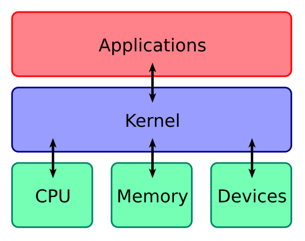

## Giriş

İşletim sistemlerinin içinde bir tür "çekirdek" olduğunu duymuşsunuzdur, hepimiz (farkında olarak veya olmadan) çok büyük bir sıklıkla bu çekirdek ile etkileşime geçeriz.

Bu lab'de kaputu biraz aralayıp, altında çalışan mekanizmalara göz attıktan sonra, nispeten yeni (fakat etkili) bir teknoloji olan eBPF'ten ve eBPF'in çekirdek ekosistemine kattıklarından bahsedeceğiz.

## Çekirdek (Kernel) nedir?

::remark-box
---
kind: info
---

Resmin Kaynağı: https://en.wikipedia.org/wiki/Kernel_(operating_system)#/media/File:Kernel_Layout.svg
::

İşletim Sistemi çekirdeği, İşletim Sisteminin merkezinde olup sistemin tüm noktalarına tam ve doğrudan erişim hakkına sahip olan ve sistemin içindeki diğer programları koordine eden bir bilgisayar programıdır. 

Bununla birlikte, çekirdek donanım ile yazılım arasında bir köprü görevi görür. Donanım kaynaklarını yönetir ve uygulamaların bu kaynaklara erişimini sağlar.

Çekirdekğin kendisi hariç bilgisayarda çalışan tüm programlara kullanıcı alanı (userspace) programları denir. Günlük hayatta somut olarak etkileşime geçtiğimiz çoğu uygulama (web tarayıcıları, ofis programları, oyunlar vb.) kullanıcı alanı (userspace) programlarıdır.

Bu tür programlar donanım kaynaklarına (CPU, RAM, disk, network kartları vb.) erişmek istediğinde, bunu doğrudan yapamaz. Bunun yerine, çekirdek aracılığıyla bu kaynaklara erişir. Çekirdek, donanım kaynaklarını yönetir ve uygulamaların bu kaynaklara erişimini düzenler.

## Sistem Çağrıları (Syscalls)

Yukarıda belirttiğimiz gibi, kullanıcı alanı programları donanım kaynaklarına doğrudan erişemezler. Bunun yerine, çekirdek aracılığıyla bu kaynaklara erişirler. Bu erişim işlemi, sistem çağrıları (syscalls) adı verilen özel işlevler aracılığıyla gerçekleştirilir.

Sistem çağrıları, kullanıcı alanı programlarının çekirdek ile iletişim kurmasını sağlar. Örneğin, bir dosya açmak, bir ağ bağlantısı kurmak veya bellek ayırmak gibi işlemler için sistem çağrıları kullanılır.
